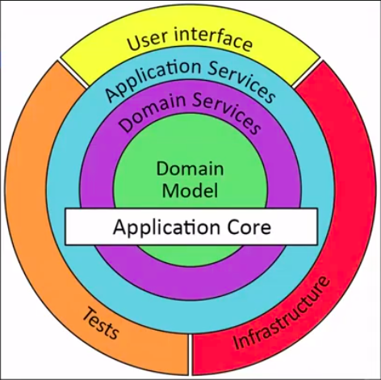

# Starting with F sharp

This repository will be used to store some initial level projects written in F#. F# (reads F sharp), is a functional language maintaned by Microsoft and works like a functional version of the C# language, also backed by Microsoft.

For the Ionide extension to work correctly in my environment (Ubuntu 20.04 + VS Code) I had to downgrade its version to the 4.17.0.

Some definitions of this universe of functional programming:

* Pure function -> Returns constant output for a given input. It's a deterministic function, so it doesn't have side effects. This last property means that there are no changes in the system or other system (mutable state, database updates, web requests, IO).

* The main difference between Class Library and Console Application is the output itself. In a Class Library, when we build it, it will generate a dll, which is a dynamically linked library, which is a piece of code you can use in other projects. It's linked in runtime. And the Console Application generates an exe, that's an executable.

## Architecture:

```Union layer```



## Run the project:

```bash
# must have the dotnet installed
$ dotnet run
```

---
## References:

_Thanks Ben Gobeil and Iago Henrique, for sharing his youtube channel with me._

1. [Getting Started with .NET/F# - How to setup a basic Development Environment [Windows/Mac/Linux]](https://www.youtube.com/watch?v=Ar20aMQxR7I&ab_channel=BenGobeil)
2. [F# Fundamentals Tutorial | Learn Functional Programming | Step-by-Step Guide](https://www.youtube.com/watch?v=SvOInBxPL30&ab_channel=BenGobeil)
3. [Writing a Simple Application in F# + Live Refactoring | Basic Functional Software Design Walkthrough](https://www.youtube.com/watch?v=gNARAXJd_tM&ab_channel=BenGobeil)